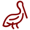

[You are now in a GitHub source code view - click this link to view Read Me file as a web page]( https://sps-pelicans.github.io/#about.md "View file as a web page." ) 

# About Pelicans

Pelicans is a community based around [Saint Paul's School]( https://sps.edu ) of Concord NH. Wikipedia describes the school as:

> St. Paul's School (also known as St. Paul's or SPS) is a highly selective college-preparatory, coeducational boarding school in Concord, New Hampshire, affiliated with the Episcopal Church. It is often regarded as one of the most elite boarding schools in the United States.

The opinions expressed herein are those of the authors.

The community and this web presence have no direct relationship with the School other than deep love.

***

